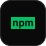

<!-- ════════════════════════  HERO  ════════════════════════ -->

<!-- ════════════════════════  SOCIAL  ════════════════════════ -->

  
  &nbsp;
  
  &nbsp;
  
  &nbsp;
  

<!-- ════════════════════════  ABOUT  ════════════════════════ -->

## ABOUT

I'm a full-stack and mobile developer based in Lagos, Nigeria, building products end-to-end — design, code, and deployment.

> *"I build products end-to-end — design, code, and ship."*

- Core stack: React Native / Expo, Next.js, Supabase, Netlify
- Currently building **ChargeFinder NG**, an EV charging station locator for Nigeria's growing EV market
- I write open-source npm packages aimed at African developer infrastructure — geocoding, TTS, USSD routing
- Shipped production platforms for community and nonprofit organizations, including the Da Hausa Initiative and Al-Furqan Centre
- HND Computer Science · exploring cybersecurity/DevSecOps as a specialization

<!-- ════════════════════════  WHAT I DO  ════════════════════════ -->

## WHAT I DO

<!-- ════════════════════════  FEATURED OSS  ════════════════════════ -->

## FEATURED OPEN SOURCE

<!-- These cards are auto-generated nightly by .github/workflows/update-stats.yml
     via scripts/generate-stats.js — live npm downloads + GitHub stars, no manual edits needed.
     (Cards further down this page — AI Projects, Corporate Sites, Ventures — come from
     scripts/generate-projects.js; the What I Do banner comes from scripts/generate-whatido.js.
     All four run together via `npm run generate`.) -->

  

  

  

  

| Package | What it does |
|---|---|
| [`react-native-naira-utils`](https://www.npmjs.com/package/react-native-naira-utils) | Naira/kobo formatting, phone/network detection, and NUBAN validation for Expo apps |
| [`naija-nllb-translate`](https://www.npmjs.com/package/naija-nllb-translate) | Offline English ↔ Hausa/Igbo/Yoruba/Fulfulde/Kanuri translation via NLLB-200 on ONNX |
| [`ussd-router-plus`](https://www.npmjs.com/package/ussd-router-plus) | Express-style USSD state router with Africa's Talking and Qrios adapters |
| [`react-native-text-extract`](https://www.npmjs.com/package/react-native-text-extract) | On-device text extraction from PDF, DOCX, XLSX, and CSV, with API fallback |

<!-- ════════════════════════  AI PROJECTS  ════════════════════════ -->

## AI PROJECTS

  

[Live demo](https://seizure-sentinel-1.onrender.com/) · [Repo](https://github.com/okewunmi/seizure-sentinel)

  

[Live demo](https://consensus-bridge.netlify.app/) · [Repo](https://github.com/okewunmi/consensus-bridge)

  

[Download the Android app](https://www.upload-apk.com/en/DssbK9PV8KUgfvW/)

  

[Try the playground](https://voxifyweb.netlify.app/upload)

<!-- ════════════════════════  CORPORATE SITES  ════════════════════════ -->

## WEBSITES FOR CORPORATE BODIES

  

[Site](https://dahausainitiative.org/) · [Repo](https://github.com/okewunmi/dhi-website)

  

[Site](https://mcanoyo.org.ng/) · [Repo](https://github.com/okewunmi/Mcan-oyo)

<!-- ════════════════════════  VENTURES  ════════════════════════ -->

## VENTURES &amp; PROJECTS

  

  

  

[okewunmi.netlify.app](https://okewunmi.netlify.app/)

<!-- ════════════════════════  FOOTER  ════════════════════════ -->

 

**Let's build something useful.**

